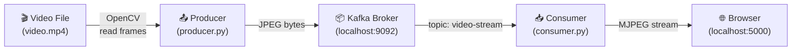
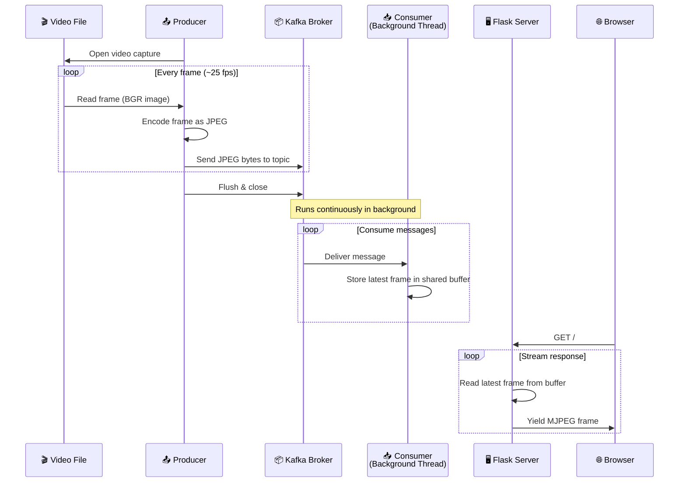
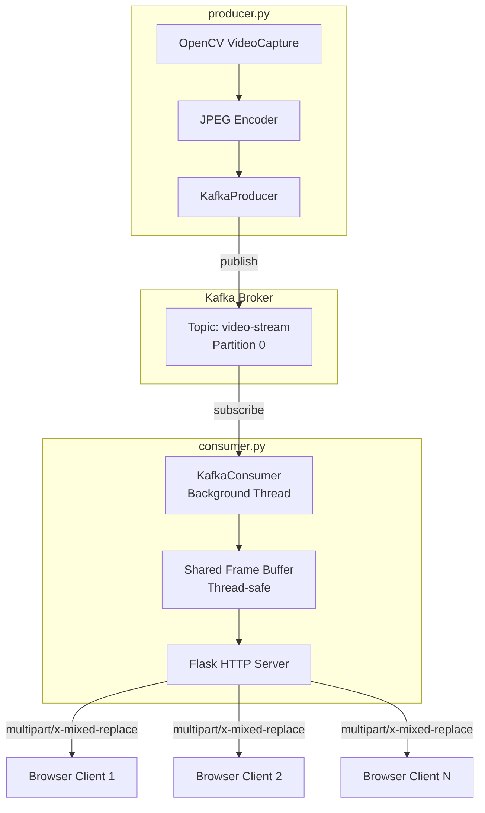

# Simple Kafka Video Stream


A minimal example of **real-time video streaming with Apache Kafka** — a producer reads a video file frame-by-frame and publishes JPEG frames to a Kafka topic, while a Flask consumer serves them as an MJPEG stream in the browser.

## What is Kafka?

Kafka is an open-source distributed streaming platform that simplifies data integration between systems.
See the [official docs](https://kafka.apache.org/documentation.html#gettingStarted) for more info.

**Three main components:**

1. **Producer** — the service that publishes data
2. **Broker** — Kafka itself, the middleware that stores and delivers messages
3. **Consumer** — the service that reads and processes the data

## Architecture

### High-Level Flow



### Detailed Data Flow



### Component Architecture



## Prerequisites

- Python 3.10+
- Apache Kafka running on `localhost:9092` (default)

### Installing Kafka

- **macOS:** `brew install kafka && brew services start kafka`
- **Linux:** follow the [official quickstart](https://kafka.apache.org/quickstart)
- **Docker:** `docker run -d --name kafka -p 9092:9092 apache/kafka`

## Setup

```bash
git clone https://github.com/amwaleh/Simple-stream-Kafka.git
cd Simple-stream-Kafka
python -m venv venv && source venv/bin/activate   # Windows: venv\Scripts\activate
pip install -r requirements.txt
```

## Running

You need **two terminals**:

**Terminal 1 — Producer** (reads `video.mp4` and sends frames to Kafka):

```bash
python producer.py              # default: video.mp4
python producer.py myvideo.avi  # or specify a file
```

**Terminal 2 — Consumer** (Flask server that streams frames to the browser):

```bash
python consumer.py
```

Open your browser at **http://localhost:5000**

## Configuration

All settings can be overridden with environment variables:

| Variable | Default | Description |
|---|---|---|
| `KAFKA_BROKER` | `localhost:9092` | Kafka bootstrap server |
| `KAFKA_TOPIC` | `video-stream` | Kafka topic name |
| `FRAME_INTERVAL` | `0.04` | Seconds between frames (~25 fps) |
| `PORT` | `5000` | Flask server port |
